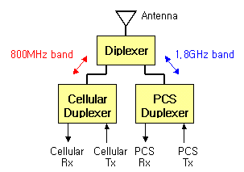

 
# RFFE (RF Front-End)

# RF 주요 부품

## Antenna

실제 신호를 송신하거나 발신하는 장치

## Duplexer

수신과 송신을 동시에 수행하기 위해 사용하는 장치

## PA(Power Amplifier)

**Power Amplifier (PA)** 는 전자 및 통신 시스템에서 신호의 전력을 증폭하는 데 사용되는 중요한 장치이다. 주로 송신기에서 사용되며, 안테나로 신호를 전송하기 전에 신호의 출력 전력을 증폭하여 보다 먼 거리로 전송할 수 있도록 한다.

## DA(Drive Amplifier)

Drive Amplifier는 고출력 **Power Amplifier(PA)** 에 입력 신호를 전달하기 전에 신호를 증폭하는 중간 증폭기입니다. Drive Amplifier는 Power Amplifier가 적절한 신호 레벨에서 작동하도록 입력 신호를 조정하여 시스템 성능을 최적화합니다.

## LNA (Low Noise Amplifier)

**LNA (Low Noise Amplifier)** 는 무선 통신 시스템에서 매우 중요한 구성 요소로, **신호 대 잡음비(SNR)** 를 유지하며 약한 RF 신호를 증폭하는 역할을 합니다. 주로 수신기 단계에서 사용되며, 신호 손실을 최소화하면서 신호의 전력을 증폭합니다.

## PA, DA, LNA, Duplexer, Diplexer, Antenna 비교

| **구성 요소**           | **위치**                      | **주요 역할**                                                        | **특징**                                                                                      | **응용 분야**                     |
|-------------------------|-----------------------------|---------------------------------------------------------------------|---------------------------------------------------------------------------------------------|----------------------------------|
| **PA (Power Amplifier)** | 송신기 출력 단계               | 신호 전력을 증폭하여 안테나로 전송 가능하게 함                             | - 높은 출력 전력 (수 W~수백 W) - 높은 효율성과 선형성 필요                                    | 무선 통신 (LTE, 5G, Wi-Fi), 방송 |
| **DA (Drive Amplifier)** | 송신기 중간 단계               | Power Amplifier에 전달하기 위해 신호를 중간 전력 수준으로 증폭                  | - 중간 출력 전력 (수 mW~수 W) - 선형성과 임피던스 매칭 중요                                    | 무선 통신 송신기, 위성 통신      |
| **LNA (Low Noise Amplifier)** | 수신기 입력 단계               | 약한 신호를 증폭하여 신호 품질(SNR)을 유지                                | - 낮은 노이즈 지수 (Noise Figure) - 높은 선형성과 대역폭 필요                                   | 무선 통신 수신기, 위성 통신, IoT |
| **Duplexer**             | 송수신기 간 신호 분리 및 결합 단계    | 동일한 안테나에서 송신과 수신 신호를 분리하여 간섭 방지                       | - 송신 및 수신 신호를 분리 - 고주파 필터링 역할                                                  | 무선 통신 시스템, 레이더         |
| **Diplexer**             | 안테나와 송수신기 사이          | 서로 다른 주파수 대역의 신호를 분리 또는 결합                              | - 특정 주파수 대역에서 신호 분리 - 멀티밴드 통신에서 필수                                          | LTE/5G 다중 대역, 위성 통신      |
| **Antenna**              | 송신기 출력 또는 수신기 입력 단말     | RF 신호를 전파로 변환하여 전송하거나, 전파를 RF 신호로 변환                   | - 특정 주파수 대역 최적화 - 안테나 설계(길이, 방향성)에 따라 성능 차이 발생                           | 모든 RF 통신 시스템              |

---

## 추가 설명

### 1. Power Amplifier (PA)
- **위치**: 송신기 출력 단계.
- **역할**: 송신 신호를 고출력으로 증폭하여 먼 거리까지 도달 가능하게 함.
- **특징**: 효율성과 선형성 사이의 균형이 중요.

### 2. Drive Amplifier (DA)
- **위치**: 송신기 중간 단계.
- **역할**: PA 입력 신호의 수준을 조정하며, PA가 최적의 성능을 내도록 지원.
- **특징**: 선형성 및 임피던스 매칭이 필수.

### 3. Low Noise Amplifier (LNA)
- **위치**: 수신기 입력 단계.
- **역할**: 수신된 약한 신호를 증폭하여 다음 단계에서 신호를 처리 가능하게 함.
- **특징**: 노이즈 지수를 낮추는 것이 주요 목표.

### 4. Duplexer
- **위치**: 송수신기 간 신호 분리 및 결합 단계.
- **역할**: 동일한 안테나를 통해 송신과 수신 신호를 분리하며, 간섭을 방지. 내부에는 BPF 를 활용하여 송신 주파수와 수신주파수를 분리함
- **특징**: BPF가 핵심 기술.

### 5. Diplexer
- **위치**: 안테나와 송수신기 사이.
- **역할**: 서로 다른 주파수 대역의 신호를 분리하거나 결합. LPF 와 HPF 만을 사용하여 Duplexer 에 비해 구현 난이도가 쉬움
- **특징**: 멀티밴드 시스템에서 사용.

### 6. Antenna
- **위치**: 송신기 출력 또는 수신기 입력 단말.
- **역할**: RF 신호와 전파 사이의 변환 역할을 수행.
- **특징**: 설계에 따라 대역폭, 방향성, 이득(Gain) 등이 결정.

---

## 응용 예
### 송신기
1. **구성**: DA → PA → Duplexer → Antenna.
2. **역할**: 신호 증폭 후 전파로 전송.

### 수신기
1. **구성**: Antenna → Duplexer → LNA.
2. **역할**: 약한 신호 증폭 후 다음 단계로 전달.

## Duplxer와 Diplxer 운용 예시

- 위와 같이 각 주파수별로 RF 시스템은 별도로 존재할 것이지만, 그것들을 처음에 나누어줄 때 **Diplexer**가 있음으로써 각 주파수밴드끼리 신호가 섞이는 일을 보다 더 확실하게 막을 수 있다. 

- 어차피 각각의 신호 송수신주파수의 정교한 선택은 **duplexer**가 담당하므로, 안테나 단에서는 그냥 band 두 개만 구분해줄 수 있는 **diplexer**만 있어도 서로 다른 band간의 Isolation 특성을 강화시킬 수 있다.

- 이처럼 **Diplexer**는 Duplexer와 매우 비슷하지만, 사용하는 필터와 사용목적이 다소 다르다.

**Duplexer** 와 **Diplexer** 를 활용한 Multi-band 단말 활용 예시

- Band 구분은 **Diplexer** 로 각 주파수 band 끼리 신호가 섞이는 일을 확실히 막는다.

- FDD 시스템에서 각각의 신호 송수신 주파수의 정교한 선택은 BPF를 사용하는
**Duplexer** 가 맡는다. 

# LPAMiD, LFEM, LPAMiF 주요 장단점 비교

| **부품**         | **장점**                                                                                     | **단점**                                                                                   |
|------------------|---------------------------------------------------------------------------------------------|-------------------------------------------------------------------------------------------|
| **LPAMiD**       | - **통합 설계**로 PA와 Duplexer가 결합되어 공간 절약 - **효율성 향상**: 송수신 신호의 간섭 최소화 - **다중 대역 지원** 가능 | - **복잡성 증가**로 제조 비용 상승 - 설계 최적화 필요, 특정 대역에 제약이 있을 수 있음   |
| **LFEM**         | - **저주파 대역** 최적화 - 소형화로 기기 내부 공간 활용에 유리 - 전력 효율이 뛰어나 배터리 소모 감소 - **단순한 구조**로 비용 효율적 | - **고주파 대역**에 적합하지 않음 - 추가 부품 필요(중간 대역 이상에서 동작하려면 추가 모듈 필요) |
| **LPAMiF**       | - **필터 통합**으로 신호 품질 향상 - 간섭 최소화, 고효율 신호 처리 가능 - **저잡음 설계(LNA 포함 가능)**로 고품질 신호 제공 - 5G 및 LTE에서 **고성능** 발휘 | - **설계 복잡도**로 인해 비용 상승 - 특정 주파수 대역에 제한될 가능성 있음 - 필터 성능에 따라 추가 설계 필요 |

---

## 추가 분석
1. **LPAMiD**는 송수신 신호의 분리(Duplexing)가 중요한 고주파 대역에서 매우 유용하며, 멀티모드 스마트폰과 같은 복잡한 기기에 적합합니다. 하지만 설계가 더 복잡해 비용이 상대적으로 높습니다.
   
2. **LFEM**은 저주파 대역을 처리하는 데 초점을 맞추며 단순한 구조와 낮은 전력 소모가 장점입니다. 그러나 중간 대역 이상의 고주파 작업에는 한계가 있어 보완이 필요합니다.

3. **LPAMiF**는 필터링 기술을 통해 신호 품질과 간섭 문제를 해결하는 데 강점이 있으며, 고성능 통신 기기에 적합합니다. 하지만 고급 설계로 인해 제조 비용이 더 높을 수 있습니다.

---

## 추천 사용 환경
- **LPAMiD**: 고주파 대역(5G 및 LTE)에서 송수신 간섭이 적어야 하는 스마트폰.
- **LFEM**: IoT 디바이스 및 단순 무선 통신 시스템에서 저비용, 저전력 솔루션. RF 필터와 스위치 그리고 스위치를 결합한 것
- **LPAMiF**: 고품질 신호와 간섭 최소화가 필요한 고성능 5G/LTE 통신 장비.

# RFFE와 SRS

## SRS(Sounding Reference Signal)란?
- **SRS**는 무선 통신에서 기지국(BS) 또는 네트워크가 사용자 장치(UE)의 업링크 채널 상태를 평가하기 위해 사용되는 신호입니다.
- LTE 및 5G 네트워크에서 SRS는 주로 **업링크 채널 품질**을 파악하고 최적의 빔포밍 및 자원 할당을 수행하기 위해 사용됩니다.

---

## LPAMiF가 필요한 이유

### 1. 신호 품질 및 정확도 보장
- SRS는 정확하고 고품질의 업링크 신호를 전송해야 합니다.
- **LPAMiF의 필터(Filter)**는 업링크 신호에서 **잡음 및 간섭**을 제거하여 SRS의 정확도를 향상시킵니다.

### 2. 저주파 대역(UL Low Band) 지원
- SRS는 다양한 주파수 대역에서 동작하지만, 특히 **저주파 대역**(600MHz~1GHz)에서 성능 최적화가 중요합니다.
- **LPAMiF**는 저주파 대역에서 신호 증폭(PA)과 필터링을 통합적으로 처리하여 **효율적인 주파수 자원 사용**을 지원합니다.

### 3. 업링크 성능 최적화
- 업링크 신호는 기지국으로 전송되기 전 **충분히 증폭**되어야 합니다.
- **LPAMiF의 PA(Power Amplifier)**는 SRS 신호를 적절히 증폭하여 신호가 기지국까지 정확히 도달하도록 합니다.

### 4. 간섭 최소화
- SRS는 네트워크의 다른 신호와 혼선이 생길 가능성이 있습니다.
- **LPAMiF의 필터링 기능**은 이러한 간섭을 줄이고, SRS가 필요한 대역에서 정확한 성능을 유지하도록 합니다.

### 5. 소형화 및 통합 효율성
- LPAMiF는 PA, 필터, 스위치 등을 하나의 모듈로 통합하여 스마트폰과 같은 소형 디바이스에서 공간 효율성을 제공합니다.
- 이는 5G와 같은 다중 대역 환경에서 SRS 처리 효율을 높이는 데 기여합니다.

### 6. 전력 효율성
- SRS는 지속적으로 전송되기 때문에 전력 소모가 누적될 수 있습니다.
- **LPAMiF의 설계**는 낮은 전력 소모로 장시간 SRS 전송을 가능하게 합니다.

---

## 결론
SRS는 네트워크가 업링크 채널 상태를 분석하고 최적의 통신 환경을 제공하는 데 필수적인 요소입니다. **LPAMiF**는 업링크 신호 품질을 보장하고, 간섭을 줄이며, 전력 효율성을 제공함으로써 SRS 성능을 극대화합니다. 이는 특히 5G와 같은 고속, 고품질 통신 환경에서 중요한 역할을 합니다.
